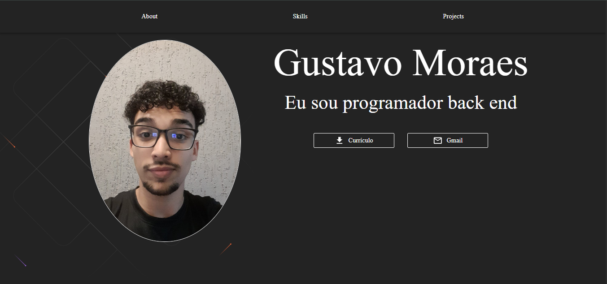
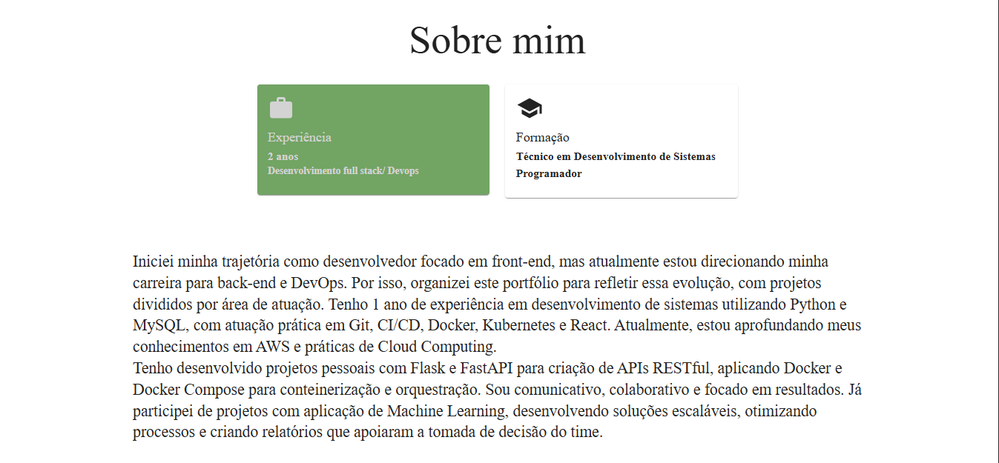
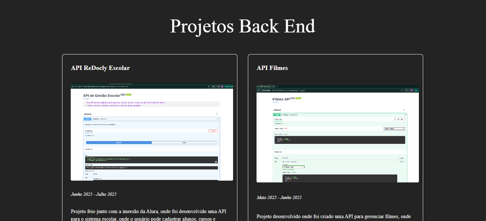
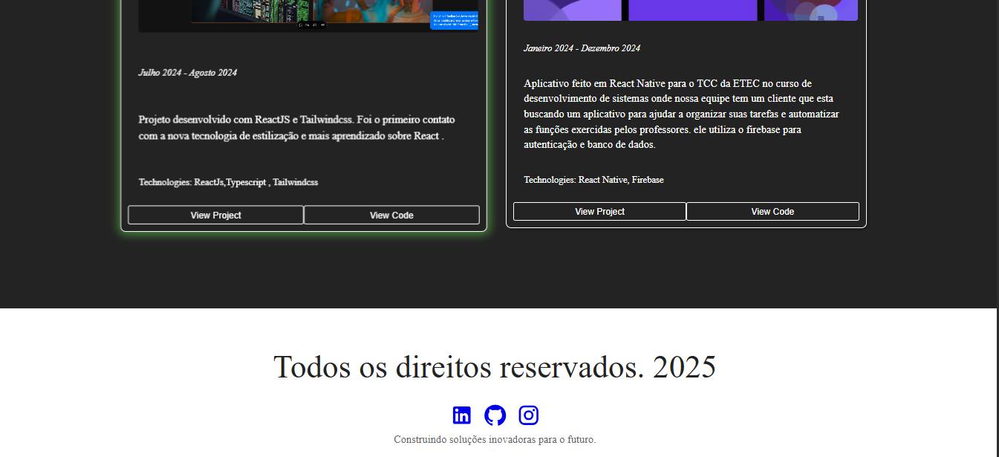

# 📌 Portfólio - Gustavo Moraes

Este é o meu portfólio pessoal desenvolvido com **React + Vite**, onde apresento um pouco sobre mim, minhas habilidades, projetos e formas de contato.  
O objetivo é centralizar em um só lugar minhas experiências e trabalhos, servindo como vitrine para oportunidades profissionais e um jeito de guardar um pouco minha trajetória.

## 🖥️ Tecnologias utilizadas
- ⚛️ **React**  
- ⚡ **Vite**  
- 🎨 **CSS**  

## 📂 Estrutura do portfólio
- **Contato** → formas de falar comigo ( Email e curriculo).
- **Sobre mim** → breve resumo da minha trajetória e objetivos.  
- **Habilidades** → principais tecnologias que domino.  
- **Projetos** → alguns dos trabalhos que já desenvolvi.  


## 🚀 Como rodar o projeto
Clone o repositório e rode os seguintes comandos:

```bash
# Instalar dependências
npm install

# Rodar em ambiente de desenvolvimento
npm run dev

# Gerar build de produção
npm run build
```

## 🔗 Acesse online
👉 [Link do Portfólio](https://my-portfolio-roan-psi-88.vercel.app/)  

## 📬 Contato
- 💼 [LinkedIn](https://www.linkedin.com/in/gustavo-moraes-dev/)  
- 🐙 [GitHub](https://github.com/gMoraes1)  
- ✉️ Email: gustavo.correiademoraes2006@gmail.com 

## Fotos 





